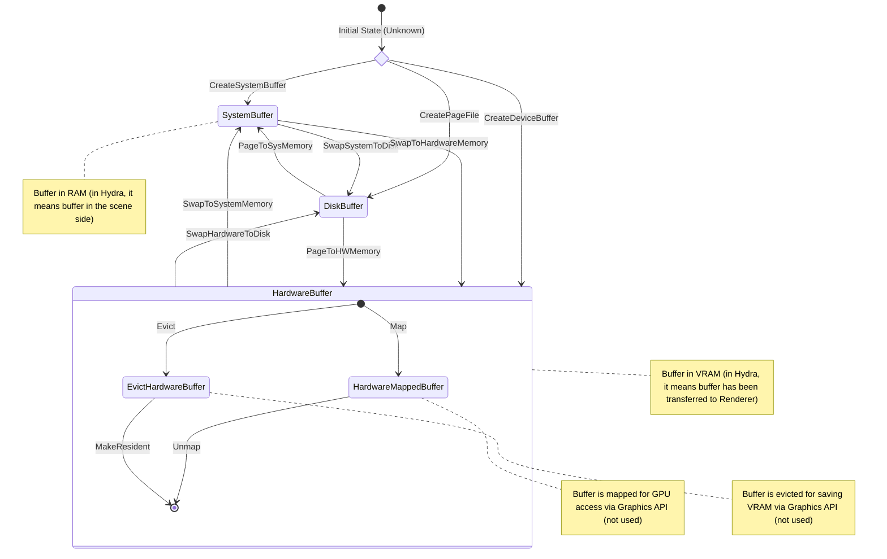
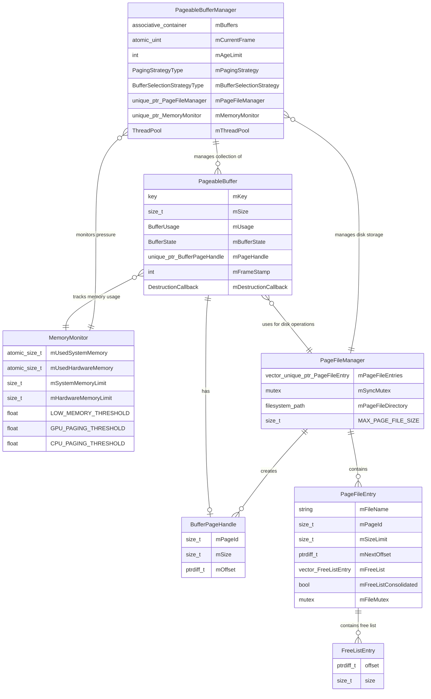
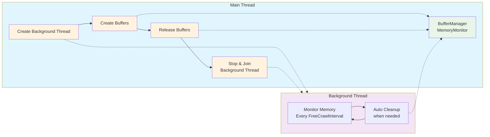
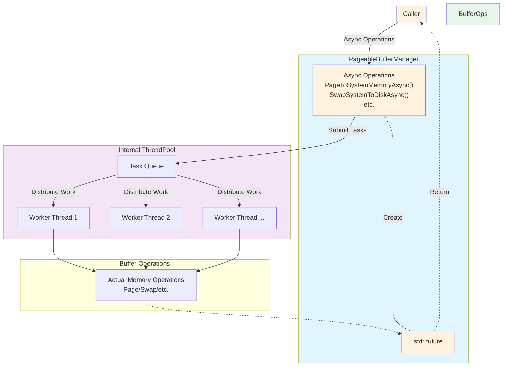

# Memory Paging System

The memory paging system is an extension to current OpenUSD data sources. The primary purpose of introducing memory paging system is to **reduce the system memory usage without obvious performance regression**. To simplify things at this stage, the GPU memory management can be ignored for now and, the paging system can be triggered on-demand. Meanwhile, it should be general and extensible.

Because the paging system needs to adapt to different scenarios:
- On-demand paging (e.g. consolidation).
- Automatic tracking and paging (e.g. in applications).

It does not provide a closed-form solution, but rather **building blocks**:
- **Pageable DataSources**
- **Page Buffer Manager** (encapsulating Page File Manager)
- **Paging Strategies**

Note that the paging system is expected to be applicable in different workflows with different configs within one application, it avoids anything global (e.g. a singleton buffer manager).

## Features Support

- **Three-tier memory hierarchy**: Scene Memory, Renderer Memory, Disk Storage
- **Adaptive paging**: On-demand / Automatic paging based on configurable strategies (e.g. memory pressures, age, etc.)
- **Asynchronous operations**: Background memory processing

## Architecture

### Key Concepts

1. **Buffer States**: UnKnown, System (Scene), Hardware (Renderer), Disk
2. **Buffer Usage**: Static (paged if possible), Dynamic (paged if necessary)
3. **Core Operations**: Buffer Creation, Data Copy, Buffer Disposal
4. **Paging Operations**:
   1. Page: Create new buffer and fill data. Keep the source buffer (e.g. `PageToDisk`).
   2. Swap: Create new buffer and fill data. Release the source buffer (e.g. `SwapSceneToDisk`).
5. **Free Crawling**: Periodic cleanup of resources using configurable strategies

### Usages

Ideally, users should use PageBufferManager as the entry point.

Usage1: Paging On-demand (asynchronously):
```cpp
// Create a Buffer Manager when initializing
PageableBufferManager<..., ...> bufferManager;
 
// Create a buffer
constexpr size_t MB = 1024 * 1024;
auto buffer = bufferManager.CreateBuffer(bufferPath, 50 * MB, BufferUsage::Static);

// Start some async operations
auto swapFuture = bufferManager.SwapSceneToDiskAsync(buffer);
auto pageFuture = bufferManager.PageToSceneMemoryAsync(buffer);

// Wait for operations (if needed)
swapFuture.wait();
// or, wait for all operations to complete
// bufferManager.WaitForAllOperations();
```

Usage2: Moniter & Automatic Freecrawl (recommend in background thread):
```cpp
// Create a Buffer Manager when initializing
PageableBufferManager<..., ...> bufferManager;
 
// Create some buffers with different characteristics using factory
constexpr size_t MB = 1024 * 1024;
auto buffer1 = bufferManager.CreateBuffer("SmallBuffer", 20 * MB, BufferUsage::Static);
auto buffer2 = bufferManager.CreateBuffer("MediumBuffer", 50 * MB, BufferUsage::Static);
auto buffer3 = bufferManager.CreateBuffer("LargeBuffer", 100 * MB, BufferUsage::Static);
 
// ...advance frames when doing the rendering
bufferManager.AdvanceFrame();
 
// In a background thread, at a certain time interval
// check 50% of buffers to see if they get chance to page out 
bufferManager.FreeCrawl(50.0f);
// or, use async free crawl
// auto futures = bufferManager.FreeCrawlAsync(20.0f);
// for (auto& future : futures) {
//     future.wait();
// }
```

Note that for disposable intermediate data, users should directly control by themselves or using `std::move`. 

### Detailed Designs

#### Buffer

The following diagram indicates the state transition:



The ER diagram shows the key classes and their relationships in the memory paging system:



Core Classes:

1. **PageableBuffer** - The central entity that manages memory buffers across different storage locations (scene/RAM, renderer/VRAM, disk storage).
2. **PageableBufferManager** - Template-based buffer manager with configurable paging and selection strategies. Manages the lifecycle and aging of multiple buffers with background processing.
3. **MemoryMonitor** - Tracks memory usage and calculates memory pressure for both system/scene and hardware/renderer memory.
4. **PageFileManager** - Handles disk paging operations and file management.

Supporting Classes:

1. **BufferPageHandle** - Value object containing page metadata (ID, size, offset) for disk operations  
2. **PageFileEntry** - Manages individual page files on disk with free space tracking
3. **FreeListEntry** - Simple data structure for tracking available free space in page files

Hydra Integration Classes:

1. **HdPageableContainerDataSource** - Memory-managed container data source
2. **HdPageableVectorDataSource** - Memory-managed vector data source
3. **HdPageableSampledDataSource** - Memory-managed sampled data source for time-sampled values
4. **HdPageableBlockDataSource** - Memory-managed block data source

Design Patterns:
- **RAII**: Buffer uses RAII for automatic memory management
- **Three-tier Architecture**: System RAM → Hardware/GPU Memory → Disk storage hierarchy
- **Free List Management**: Efficient disk space reuse through gap tracking

#### Paging Control

The system abstracts paging strategy and buffer selection strategy, decoupling them from buffer management. Both strategies are configurable but should be determined at compile time for simplicity and optimal performance:

Configurable Strategies:
```cpp
// Concept for paging strategies
// Use traits alternatively if C++20 is not supported
template<typename T>
concept PagingStrategyLike = requires(T t, const PageableBufferBase& buffer, const PagingContext& context) {
    { t(buffer, context) } -> std::convertible_to<PagingDecision>;
};
 
// Concept for buffer selection strategies
// Use traits alternatively if C++20 is not supported 
template<typename T, typename InputIterator>
concept BufferSelectionStrategyLike = requires(T t, InputIterator first, InputIterator last, const SelectionContext& context) {
    { t(first, last, context) } -> std::convertible_to<std::vector<std::shared_ptr<PageableBufferBase>>>;
};

// Template-based buffer manager
template<PagingConcepts::PagingStrategyLike PagingStrategyType, 
         PagingConcepts::BufferSelectionStrategyLike BufferSelectionStrategyType>
class PageableBufferManager {
// ......
private:
    // Compile-time strategy instances (no runtime changing)
    PagingStrategyType mPagingStrategy{};
    BufferSelectionStrategyType mBufferSelectionStrategy{};
};
```

Set configuration options:
```cpp
// Configure  during BufferManager creation
PageableBufferManager::InitializeDesc desc;
desc.numThreads = 4;  // Number of worker threads
desc.pageFileDirectory = std::filesystem::temp_directory_path() / "temp_pages"; // Temp page file dest.
desc.ageLimit= 20; // Frame count before resource is considered old.
desc.sceneMemoryLimit = 2ULL * 1024 * 1024 * 1024; // Byte.
desc.rendererMemoryLimit = 1ULL * 1024 * 1024 * 1024; // Byte.

// Configure background cleanup for MemoryManager  
memoryManager.SetFreeCrawlInterval(100);  // Check every 100ms
memoryManager.SetFreeCrawlPercentage(10.0f);  // Check 10% of buffer
```

Simplified implementation details:
1. Use selection strategy to pick buffer candidates
    ```cpp
    std::vector<std::shared_ptr<PageableBufferBase>> selectedBuffers = 
        mBufferSelectionStrategy(mBuffers.begin(), mBuffers.end(), selectionContext);
    ```
2. For each buffer, execute paging according to paging configs
    ```cpp
    PagingDecision decision = mPagingStrategy(*buffer, context);
    bool isDisposed = ExecutePagingDecision(*buffer, decision);
    ```

#### Thread Mode

We propose two usages:
1. Use a background thread to perform the memory freecrawl in some certain time interval:


2. Use a MemoryPool to finish the buffer operations asynchronously:

