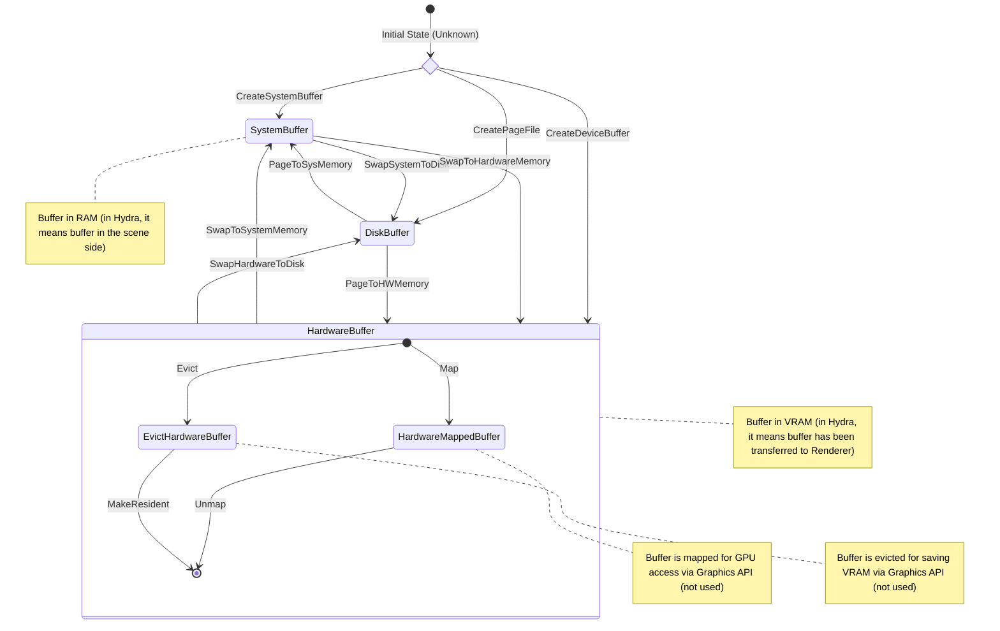
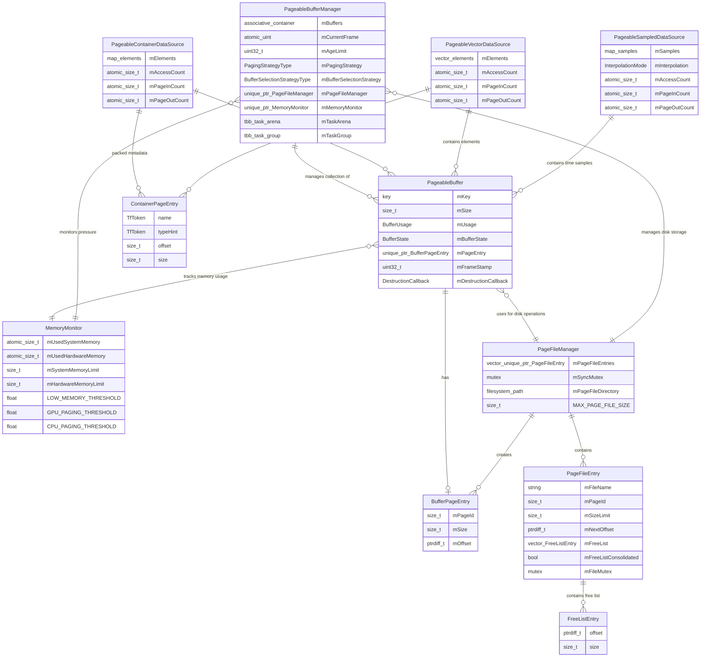
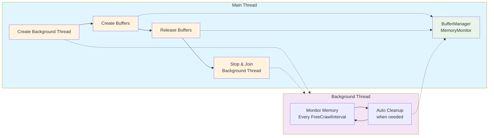
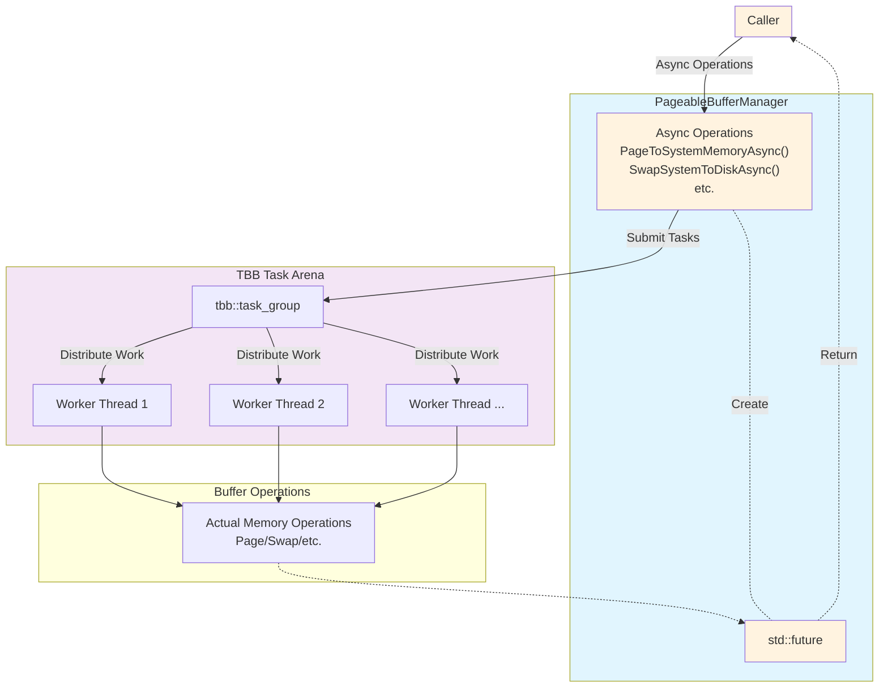

# Memory Paging System

The memory paging system is an extension to current OpenUSD data sources. The\
primary purpose of introducing memory paging system is to **reduce the system\
memory usage without obvious performance regression**. To simplify things at\
this stage, the GPU memory management can be ignored for now and, the paging\
system can be triggered on-demand. Meanwhile, it should be general and\
extensible.

Because the paging system needs to adapt to different scenarios:
- On-demand paging (e.g. consolidation).
- Automatic tracking and paging (e.g. in applications).

It does not provide a closed-form solution, but rather **building blocks**:
- **Pageable DataSources** (non-retained and retained variants)
- **Page Buffer Manager** (encapsulating Page File Manager)
- **Paging Strategies** (compile-time configurable)

Note that the paging system is expected to be applicable in different workflows\
with different configs within one application, it avoids anything global (e.g.\
a singleton buffer manager).

## Features Support

- **Three-tier memory hierarchy**: Scene Memory, Renderer Memory, Disk Storage
- **Adaptive paging**: On-demand / Automatic paging based on configurable\
strategies (e.g. memory pressures, age, etc.)
- **Asynchronous operations**: Background memory processing via TBB task groups
- **Packed disk storage**: Container and vector elements serialized into a single\
disk buffer with metadata headers for efficient I/O
- **Observability**: Per-data-source atomic counters for access, page-in, and\
page-out operations
- **Generic key types**: Buffer manager supports custom key types beyond `SdfPath`\
via template parameters (e.g. `std::string`)
- **C++20 concepts with SFINAE fallback**: Compile-time validation of strategy\
and buffer types

## Architecture

### Key Concepts

1. **Buffer States**: Unknown, Scene (usually in RAM), Renderer (usually in VRAM), Disk
2. **Buffer Usage**: Static (paged if possible), Dynamic (paged if necessary)
3. **Core Operations**: Buffer Creation, Data Copy, Buffer Disposal
4. **Paging Operations**:
   1. Page: Create new buffer and fill data. Keep the source buffer (e.g.`PageToDisk`).
   2. Swap: Create new buffer and fill data. Release the source buffer (e.g. `SwapSceneToDisk`).
5. **Free Crawling**: Periodic cleanup of resources using configurable strategies
6. **Packed Serialization**: Composite data sources (container/vector) serialize all\
elements into one contiguous buffer with a header describing each element's offset,\
size, and type hint via `HdContainerPageEntry`.

### Usages

Ideally, users should use PageBufferManager as the entry point.

Usage 1: Paging On-demand (asynchronously):
```cpp
// Create a Buffer Manager when initializing
PageableBufferManager<..., ...> bufferManager;
 
// Create a buffer
constexpr size_t MiB = 1ULL * 1024 * 1024;
auto buffer = bufferManager.CreateBuffer(bufferPath, 50 * MiB, BufferUsage::Static);

// Start some async operations
auto swapFuture = bufferManager.SwapSceneToDiskAsync(buffer);
auto pageFuture = bufferManager.PageToSceneMemoryAsync(buffer);

// Wait for operations (if needed)
swapFuture.wait();
// or, wait for all operations to complete
// bufferManager.WaitForAllOperations();
```

Usage 2: Monitor & Automatic Freecrawl (recommend in background thread):
```cpp
// Create a Buffer Manager when initializing
PageableBufferManager<..., ...> bufferManager;
 
// Create some buffers with different characteristics using factory
auto buffer1 = bufferManager.CreateBuffer("SmallBuffer", 20 * MiB, BufferUsage::Static);
auto buffer2 = bufferManager.CreateBuffer("MediumBuffer", 50 * MiB, BufferUsage::Static);
auto buffer3 = bufferManager.CreateBuffer("LargeBuffer", 100 * MiB, BufferUsage::Static);
 
// ...advance frames when doing the rendering
bufferManager.AdvanceFrame();
 
// In a background thread, at a certain time interval
// check 50% of buffers to see if they get chance to page out 
bufferManager.FreeCrawl(50.0f);
// or, use async free crawl
// auto futures = bufferManager.FreeCrawlAsync(20.0f);
// for (auto& future : futures) {
//     future.wait();
// }
```
Note that for disposable intermediate data, users should directly control by themselves or using `std::move`. 

### Detailed Designs

#### Buffer

The following diagram indicates the state transition:


```mermaid
stateDiagram-v2
    state if_state <<choice>>

    [*] --> if_state: Initial State (Unknown)
    
    if_state --> SystemBuffer: CreateSystemBuffer
    if_state --> HardwareBuffer: CreateDeviceBuffer
    if_state --> DiskBuffer: CreatePageFile
    
    SystemBuffer --> HardwareBuffer: SwapToHardwareMemory
    SystemBuffer --> DiskBuffer: SwapSystemToDisk
    
    HardwareBuffer --> SystemBuffer: SwapToSystemMemory
    HardwareBuffer --> DiskBuffer: SwapHardwareToDisk
    
    DiskBuffer --> SystemBuffer: PageToSysMemory
    DiskBuffer --> HardwareBuffer: PageToHWMemory
    
    state HardwareBuffer {
        [*] --> HardwareMappedBuffer: Map
        HardwareMappedBuffer --> [*]: Unmap
        [*] --> EvictHardwareBuffer: Evict
        EvictHardwareBuffer --> [*]: MakeResident
    }

    note right of SystemBuffer : Buffer in RAM (in Hydra, it means buffer in the scene side)
    note right of HardwareBuffer : Buffer in VRAM (in Hydra, it means buffer has been transferred to Renderer)
    note right of HardwareMappedBuffer : Buffer is mapped for GPU access via Graphics API (not used)
    note right of EvictHardwareBuffer : Buffer is evicted for saving VRAM via Graphics API (not used)
```

The ER diagram shows the key classes and their relationships in the memory paging system:


```mermaid
erDiagram
    PageableBuffer {
        key mKey
        size_t mSize
        BufferUsage mUsage
        BufferState mBufferState
        unique_ptr_BufferPageEntry mPageEntry
        uint32_t mFrameStamp
        DestructionCallback mDestructionCallback
    }
    
    PageableBufferManager {
        associative_container mBuffers
        atomic_uint mCurrentFrame
        uint32_t mAgeLimit
        PagingStrategyType mPagingStrategy
        BufferSelectionStrategyType mBufferSelectionStrategy
        unique_ptr_PageFileManager mPageFileManager
        unique_ptr_MemoryMonitor mMemoryMonitor
        tbb_task_arena mTaskArena
        tbb_task_group mTaskGroup
    }
    
    MemoryMonitor {
        atomic_size_t mUsedSystemMemory
        atomic_size_t mUsedHardwareMemory
        size_t mSystemMemoryLimit
        size_t mHardwareMemoryLimit
        float LOW_MEMORY_THRESHOLD
        float GPU_PAGING_THRESHOLD
        float CPU_PAGING_THRESHOLD
    }
    
    PageFileManager {
        vector_unique_ptr_PageFileEntry mPageFileEntries
        mutex mSyncMutex
        filesystem_path mPageFileDirectory
        size_t MAX_PAGE_FILE_SIZE
    }
    
    BufferPageEntry {
        size_t mPageId
        size_t mSize
        ptrdiff_t mOffset
    }

    ContainerPageEntry {
        TfToken name
        TfToken typeHint
        size_t offset
        size_t size
    }
    
    PageFileEntry {
        string mFileName
        size_t mPageId
        size_t mSizeLimit
        ptrdiff_t mNextOffset
        vector_FreeListEntry mFreeList
        bool mFreeListConsolidated
        mutex mFileMutex
    }
    
    FreeListEntry {
        ptrdiff_t offset
        size_t size
    }

    PageableContainerDataSource {
        map_elements mElements
        atomic_size_t mAccessCount
        atomic_size_t mPageInCount
        atomic_size_t mPageOutCount
    }

    PageableVectorDataSource {
        vector_elements mElements
        atomic_size_t mAccessCount
        atomic_size_t mPageInCount
        atomic_size_t mPageOutCount
    }

    PageableSampledDataSource {
        map_samples mSamples
        InterpolationMode mInterpolation
        atomic_size_t mAccessCount
        atomic_size_t mPageInCount
        atomic_size_t mPageOutCount
    }
    
    PageableBuffer ||--o| BufferPageEntry : "has"
    PageableBuffer }o--|| PageFileManager : "uses for disk operations"
    PageableBuffer }o--|| MemoryMonitor : "tracks memory usage"
    
    PageableBufferManager ||--o{ PageableBuffer : "manages collection of"
    PageableBufferManager }o--|| MemoryMonitor : "monitors pressure"
    PageableBufferManager }o--|| PageFileManager : "manages disk storage"
    
    PageFileManager ||--o{ PageFileEntry : "contains"
    PageFileManager ||--o{ BufferPageEntry : "creates"
    
    PageFileEntry ||--o{ FreeListEntry : "contains free list"

    PageableContainerDataSource ||--o{ ContainerPageEntry : "packed metadata"
    PageableContainerDataSource ||--o{ PageableBuffer : "contains elements"

    PageableVectorDataSource ||--o{ ContainerPageEntry : "packed metadata"
    PageableVectorDataSource ||--o{ PageableBuffer : "contains elements"

    PageableSampledDataSource ||--o{ PageableBuffer : "contains time samples"
```

Core Classes:

1. **PageableBuffer (`HdPageableBufferBase`)** - The central entity that manages memory buffers across different storage locations (scene/RAM, renderer/VRAM, disk storage). Exposes both `Key()` and `Path()` accessors.
2. **PageableBufferManager (`HdPageableBufferManager<..., KeyType, KeyHash>`)** - Template-based buffer manager with configurable paging strategies, selection strategies, key type, and key hash. Manages the lifecycle and aging of multiple buffers with background processing via TBB.
3. **MemoryMonitor (`HdMemoryMonitor`)** - Tracks memory usage and calculates memory pressure for both system/scene and hardware/renderer memory.
4. **PageFileManager (`HdPageFileManager`)** - Handles disk paging operations and file management. Supports both raw pointer and `TfSpan`-based APIs.

Supporting Classes:

1. **BufferPageEntry (`HdBufferPageEntry`)** - Value object containing page metadata (ID, size, offset) for disk operations  
2. **ContainerPageEntry (`HdContainerPageEntry`)** - Metadata for elements within a packed container (name, typeHint, offset, size)
3. **PageFileEntry (`HdPageFileEntry`)** - Manages individual page files on disk with free space tracking
4. **FreeListEntry (`HdFreeListEntry`)** - Simple data structure for tracking available free space in page files

Hydra Integration Classes (Non-Retained):

1. **HdPageableContainerDataSource** - Memory-managed container with packed disk storage
2. **HdPageableVectorDataSource** - Memory-managed vector with packed disk storage
3. **HdPageableSampledDataSource** - Memory-managed sampled data source for time-sampled values with interpolation modes
4. **HdPageableBlockDataSource** - Memory-managed block data source

Hydra Integration Classes (Retained):

1. **HdPageableRetainedContainerDataSource** - Retained container with element-level and packed paging
2. **HdPageableRetainedSmallVectorDataSource** - Retained vector with element-level and packed paging
3. **HdPageableRetainedSampledDataSource** - Retained sampled data source with interpolation mode control

High-Level Manager:

1. **HdPageableDataSourceManager** - Provides `GetOrCreateBuffer`, background cleanup, and custom serializer support. Uses `DefaultBufferManager` internally.

Design Patterns:
- **RAII**: Buffer uses RAII for automatic memory management
- **Three-tier Architecture**: System RAM → Hardware/GPU Memory → Disk storage hierarchy
- **Free List Management**: Efficient disk space reuse through gap tracking
- **Packed Serialization**: Composite data sources pack elements into a single disk buffer
- **Compile-time Strategy Selection**: Strategies are template parameters, not virtual dispatch

#### Paging Control

The system abstracts paging strategy and buffer selection strategy, decoupling them from buffer management. Both strategies are configurable but should be determined at compile time for simplicity and optimal performance:

Configurable Strategies:
```cpp
// Concept for paging strategies
// Use traits alternatively if C++20 is not supported
template<typename T>
concept PagingStrategyLike = requires(T t, const PageableBufferBase& buffer, const PagingContext& context) {
    { t(buffer, context) } -> std::convertible_to<PagingDecision>;
};
 
// Concept for buffer selection strategies
// Use traits alternatively if C++20 is not supported 
template<typename T, typename InputIterator>
concept BufferSelectionStrategyLike = requires(T t, InputIterator first, InputIterator last, const SelectionContext& context) {
    { t(first, last, context) } -> std::convertible_to<std::vector<std::shared_ptr<PageableBufferBase>>>;
};

// Template-based buffer manager (KeyType and KeyHash default to SdfPath)
template<PagingConcepts::PagingStrategyLike PagingStrategyType, 
         PagingConcepts::BufferSelectionStrategyLike BufferSelectionStrategyType,
         typename KeyType = SdfPath,
         typename KeyHash = SdfPath::Hash>
class PageableBufferManager {
// ......
private:
    // Compile-time strategy instances (no runtime changing)
    PagingStrategyType mPagingStrategy{};
    BufferSelectionStrategyType mBufferSelectionStrategy{};
    tbb::concurrent_unordered_map<KeyType, shared_ptr<PageableBufferBase>, KeyHash> mBuffers;
};
```

Built-in Manager Aliases:
```cpp
using DefaultBufferManager = HdPageableBufferManager<HybridStrategy, LRUSelectionStrategy>;
using AgeBasedBufferManager = HdPageableBufferManager<AgeBasedStrategy, OldestFirstSelectionStrategy>;
using FIFOBufferManager = HdPageableBufferManager<HybridStrategy, FIFOSelectionStrategy>;
using PressureBasedLRUBufferManager = HdPageableBufferManager<PressureBasedStrategy, LRUSelectionStrategy>;
using ConservativeFIFOBufferManager = HdPageableBufferManager<ConservativeStrategy, FIFOSelectionStrategy>;
```

Set configuration options:
```cpp
// Configure during BufferManager creation
constexpr size_t GiB = 1ULL * 1024 * 1024 * 1024;
PageableBufferManager::InitializeDesc desc;
desc.numThreads = 4;  // Number of worker threads
desc.pageFileDirectory = std::filesystem::temp_directory_path() / "your_temp_pages"; // Temp page file dest.
desc.ageLimit= 20; // Frame count before resource is considered old.
desc.sceneMemoryLimit = 2ULL * GiB; // Byte.
desc.rendererMemoryLimit = 1ULL * GiB; // Byte.

// Configure background cleanup for MemoryManager  
memoryManager.SetFreeCrawlInterval(100);  // Check every 100ms
memoryManager.SetFreeCrawlPercentage(10.0f);  // Check 10% of buffer
```

Simplified implementation details:
1. Use selection strategy to pick buffer candidates
    ```cpp
    std::vector<std::shared_ptr<PageableBufferBase>> selectedBuffers = 
        mBufferSelectionStrategy(mBuffers.begin(), mBuffers.end(), selectionContext);
    ```
2. For each buffer, execute paging according to paging configs
    ```cpp
    PagingDecision decision = mPagingStrategy(*buffer, context);
    bool isDisposed = ExecutePagingDecision(*buffer, decision);
    ```

#### Thread Mode

We propose two usages:
1. Use a background thread to perform the memory freecrawl in some certain time interval:

```mermaid
graph LR
    subgraph I["Main Thread"]
        A["Create Background Thread"] --> B["Create Buffers"]
        B --> G["Release Buffers"]
        G --> C["Stop & Join<br/>Background Thread"]
        F["BufferManager<br/>MemoryMonitor"]
    end
    
    subgraph H["Background Thread"]
        D["Monitor Memory<br/>Every FreeCrawlInterval"] --> E["Auto Cleanup<br/>when needed"]
        E --> D
    end
    
    A -.-> H
    B -.-> F
    G -.-> F
    E -.-> F
    C -.-> H
    
    classDef main fill:#fff3e0
    class A,B,C,G main

    style I fill:#e1f5fe
    style H fill:#f3e5f5
    style F fill:#e8f5e8
```

2. Use TBB task arena and task group to finish the buffer operations asynchronously:

```mermaid
graph TD
    subgraph Caller ["Caller"]
    end
    subgraph BufferManager ["PageableBufferManager"]
        AsyncOps["Async Operations<br/>PageToSystemMemoryAsync()<br/>SwapSystemToDiskAsync()<br/>etc."]
        ReturnObj["std::future"]
    end
    
    subgraph TBBArena ["TBB Task Arena"]
        TaskGroup["tbb::task_group"]
        Worker1["Worker Thread 1"]
        Worker2["Worker Thread 2"] 
        Worker3["Worker Thread ..."]
    end
    
    subgraph Operations ["Buffer Operations"]
        BufferWork["Actual Memory Operations<br/>Page/Swap/etc."]
    end
    
    AsyncOps -->|"Submit Tasks"| TaskGroup
    TaskGroup -->|"Distribute Work"| Worker1
    TaskGroup -->|"Distribute Work"| Worker2
    TaskGroup -->|"Distribute Work"| Worker3
    
    Worker1 --> BufferWork
    Worker2 --> BufferWork
    Worker3 --> BufferWork
    
    Caller -->|"Async Operations"| AsyncOps
    AsyncOps -.-|"Create"| ReturnObj
    ReturnObj -.->|"Return"| Caller
    BufferWork -.-> ReturnObj
    
    style BufferManager fill:#e1f5fe
    style TBBArena fill:#f3e5f5

    classDef shared fill:#fff3e0
    class AsyncOps,Caller,ReturnObj shared
```

#### Key Generalization

`HdPageableBufferManager` accepts `KeyType` and `KeyHash` template parameters\
(defaulting to `SdfPath` and `SdfPath::Hash`):

```cpp
// Default: SdfPath keys
using DefaultBufferManager = HdPageableBufferManager<
    HybridStrategy, LRUSelectionStrategy>;

// Custom: std::string keys
using StringBufferManager = HdPageableBufferManager<
    HybridStrategy, LRUSelectionStrategy,
    std::string, StringKeyHash>;

StringBufferManager mgr(desc);
auto buf = mgr.CreateBuffer("my_buffer", 50 * ONE_MiB);
```

The `Keyed` concept (C++20) / `Keyed` trait (SFINAE) validates types that expose\
a `Key()` accessor. `Pathed` is an alias for `Keyed<T, SdfPath>`.

#### Packed Disk Storage

For `HdPageableContainerDataSource` and `HdPageableVectorDataSource` (and their\
retained variants), elements are not stored individually on disk. Instead, a single\
packed buffer is created:

```
┌──────────────────────────────────────────────────┐
│ Header                                           │
│  numElements: uint32_t                           │
│  For each element:                               │
│    nameLen + nameChars (container) or index (vec)│
│    typeHintLen + typeHintChars                   │
│    payloadOffset: uint64_t                       │
│    payloadSize: uint64_t                         │
├──────────────────────────────────────────────────┤
│ Payload (concatenated serialized elements)       │
│  [element 0 bytes][element 1 bytes][...]         │
└──────────────────────────────────────────────────┘
```

This reduces disk I/O operations and enables atomic page-in/page-out of entire\
data sources.

#### Debugging Facilities: Observability Metrics

Each composite data source tracks:
- **`mAccessCount`**: Number of times `Get()`/`GetElement()` was called
- **`mPageInCount`**: Number of page-in operations (from disk to memory)
- **`mPageOutCount`**: Number of page-out operations (from memory to disk)

These are `std::atomic<size_t>` counters, safe for concurrent access:
```cpp
auto container = HdPageableContainerDataSource::New(...);
// After some operations...
size_t accesses = container->GetAccessCount();
size_t pageIns  = container->GetPageInCount();
size_t pageOuts = container->GetPageOutCount();
```
