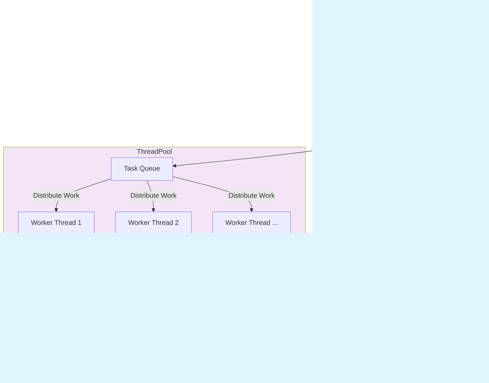

# Memory Paging System

The memory paging system is an extension to current OpenUSD data sources. The primary purpose of introducing memory paging system is to **reduce the system memory usage without obvious performance regression**. To simplify things at this stage, the GPU memory management can be ignored for now and, the paging system can be triggered on-demand. Meanwhile, it should be general and extensible.

Because the paging system needs to adapt to different scenarios:
- On-demand paging (e.g. consolidation).
- Automatic tracking and paging (e.g. in applications).

It does not provide a closed-form solution, but rather **building blocks**:
- **Pageable DataSources**
- **Page Buffer Manager** (encapsulating Page File Manager)
- **Paging Strategies**

Note that the paging system is expected to be applicable in different workflows with different configs within one application, it avoids anything global (e.g. a singleton buffer manager).

## Features Support

- **Three-tier memory hierarchy**: Scene Memory, Renderer Memory, Disk Storage
- **Adaptive paging**: On-demand / Automatic paging based on configurable strategies (e.g. memory pressures, age, etc.)
- **Asynchronous operations**: Background memory processing

## Architecture

### Key Concepts

1. **Buffer States**: UnKnown, System (Scene), Hardware (Renderer), Disk
2. **Buffer Usage**: Static, Dynamic
3. **Core Operations**: Buffer Creation, Data Copy, Buffer Disposal
4. **Paging Operations**:
   1. Page: Create new buffer and fill data. Keep the source buffer (e.g. `PageToDisk`).
   2. Swap: Create new buffer and fill data. Release the source buffer (e.g. `SwapSceneToDisk`).
5. **Free Crawling**: Periodic cleanup of resources

### Usages

Ideally, users should use PageBufferManager as the entry point.

Usage1: Paging On-demand (asynchronously):
```cpp
// Create a Buffer Manager when initializing
HdPageableBufferManager<..., ...> bufferManager;
 
// Create a buffer
constexpr size_t MB = 1024 * 1024;
auto buffer1 = bufferManager.CreateBuffer("AsyncBuffer1", 50 * MB);
 
// Start some async operations
auto swapFuture1 = bufferManager.SwapSystemToDiskAsync(buffer1);
 
// Wait for operations (if needed)
swapFuture1.wait();
// or, wait for all operations to complete
// bufferManager.WaitForAllOperations();
```

Usage2: Moniter & Automatic Freecrawl (recommend in background thread):
```cpp
// Create a Buffer Manager when initializing
HdPageableBufferManager<..., ...> bufferManager;
 
// Create some buffers with different characteristics using factory
constexpr size_t MB = 1024 * 1024;
auto buffer1 = bufferManager.CreateBuffer("SmallBuffer", 20 * MB, BufferUsage::Static);
auto buffer2 = bufferManager.CreateBuffer("MediumBuffer", 50 * MB, BufferUsage::Static);
auto buffer3 = bufferManager.CreateBuffer("LargeBuffer", 100 * MB, BufferUsage::Static);
 
// ...advance frames when doing the rendering
cacheManager.AdvanceFrame();
 
// In a background thread, at a certain time interval
// check 50% of buffers to see if they get chance to page out 
cacheManager.FreeCrawl(50.0f);
```

Note that for disposable intermediate data, users should directly control by themselves or using `std::move`. 

### Detailed Designs

#### Buffer

The following diagram indicates the state transition:


The ER diagram shows the key classes and their relationships in the memory paging system:


Core Classes:

1. **Buffer** - The central entity that manages memory buffers across different storage locations (scene/RAM, renderer/VRAM, disk storage)
2. **CacheManager** - Manages the lifecycle and aging of multiple buffers with background processing
3. **MemoryMonitor** - Tracks memory usage and calculates memory pressure for both system and hardware memory
4. **PageManager** - Handles disk paging operations and file management

Supporting Classes:

1. **PageHandle** - Value object containing page metadata (ID, size, offset) for disk operations
2. **PageFileEntry** - Manages individual page files on disk with free space tracking
3. **FreeListEntry** - Simple data structure for tracking available free space in page files

Design Patterns:
- **RAII**: Buffer uses RAII for automatic memory management
- **Three-tier Architecture**: System RAM → Hardware/GPU Memory → Disk storage hierarchy
- **Free List Management**: Efficient disk space reuse through gap tracking

#### Paging Control

Abstract the strategy and decouple it from buffer management. Make the 1) paging, and 2) buffer selection strategies configurable. For safety and simplicity, they should be determined at the compiling time:

Configurable Strategies
```cpp
// Concept for paging strategies
// Use traits alternatively if C++20 is not supported
template<typename T>
concept PagingStrategyLike = requires(T t, const OGSDemo::Buffer& buffer, const OGSDemo::PagingContext& context) {
    { t(buffer, context) } -> std::convertible_to<OGSDemo::PagingDecision>;
} || requires(T t, const OGSDemo::Buffer& buffer, const OGSDemo::PagingContext& context) {
    { t.operator()(buffer, context) } -> std::convertible_to<OGSDemo::PagingDecision>;
};
 
// Concept for buffer selection strategies
// Use traits alternatively if C++20 is not supported
template<typename T>
concept BufferSelectionStrategyLike = requires(T t, const std::vector<std::shared_ptr<OGSDemo::Buffer>>& buffers, const OGSDemo::SelectionContext& context) {
    { t(buffers, context) } -> std::convertible_to<std::vector<std::shared_ptr<OGSDemo::Buffer>>>;
} || requires(T t, const std::vector<std::shared_ptr<OGSDemo::Buffer>>& buffers, const OGSDemo::SelectionContext& context) {
    { t.operator()(buffers, context) } -> std::convertible_to<std::vector<std::shared_ptr<OGSDemo::Buffer>>>;
};
 
// Encapsulate in CacheManager
template<HdPagingConcepts::PagingStrategyLike PagingStrategyType, 
         HdPagingConcepts::BufferSelectionStrategyLike BufferSelectionStrategyType>
class HdPageableBufferManager {
// ......
private:
    // Compile-time strategy instances (no runtime changing)
    PagingStrategyType mPagingStrategy{};
    BufferSelectionStrategyType mBufferSelectionStrategy{};
};
```

Simplified implementation details:
1. Use selection strategy to pick buffer candidates
    ```cpp
    std::vector<std::shared_ptr<HdPageableBufferBase>> selectedBuffers = mBufferSelectionStrategy(mBuffers, selectionContext);
    ```
2. For each buffer, execute paging according to paging configs
    ```cpp
    PagingDecision decision = mPagingStrategy(buffer, context);
    bool isDisposed = ExecutePagingDecision(buffer, decision);
    ```

#### Thread Mode

We propose two usages:
1. Use a background thread to perform the memory freecrawl in some certain time interval:


2. Use a MemoryPool to finish the buffer operations asynchronously:

